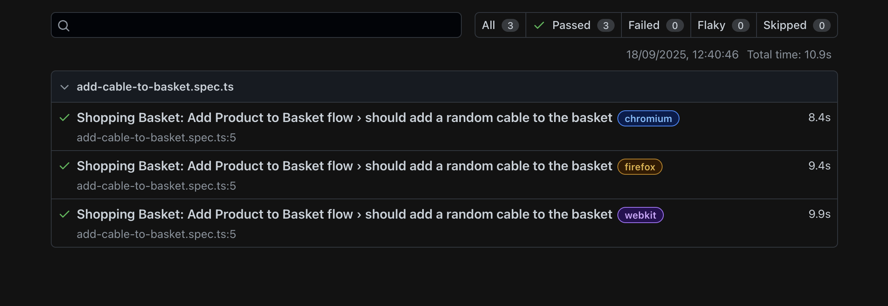

---

# 🎵 Thomann UI Automation

[](https://nodejs.org/)
[](https://www.npmjs.com/)
[](https://playwright.dev/)
[](https://www.typescriptlang.org/)
[]()

Automated UI testing for Thomann CableGuy using **🎭 Playwright**, **📘 TypeScript**, and **📂 Page Object Model (POM)**.

---

## 📑 Table of Contents

- [⚙️ Prerequisites](#⚙️-prerequisites)
- [🛠️ Installation](#🛠️-installation)
- [▶️ Run Tests](#▶️-run-tests)
- [📊 Reports](#📊-reports)
- [🖼️ Screenshots & Recordings](#📸-screenshots--🎥-recordings)
- [🤖 CI with GitHub Actions](#🤖-ci-with-github-actions)
- [📁 Project Structure](#📁-project-structure)

---

## ⚙️ Prerequisites

- **Node.js** (recommended: v20.x)
- **npm** (recommended: v10.x)

Check versions with:

```sh
🖥️ node -v
🖥️ npm -v
```

---

## 🛠️ Installation

Clone the repository:

```sh
📂 git clone https://github.com/sumant326541/thomann-ui-automation.git
📂 cd thomann-ui-automation
```

Install dependencies:

```sh
📦 npm install
```

---

## ▶️ Run Tests

Execute tests in **Chromium**, **Firefox**, and **WebKit** in parallel (headless by default):

```sh
npm run test
```

### 👀 Run tests in headed mode

```sh
npm run test:headed
```

### 🌐 Run tests only on Chromium

```sh
npm run test:chromium
```

---

## 📊 Reports

- **HTML reports** are generated in the `playwright-report` folder (configurable in `playwright.config.ts`).
- Open the report:

```sh
npm run report
```

- Test execution screenshot
  

---

## 📸 Screenshots & 🎥 Recordings

- Screenshots and recordings are automatically attached to the **HTML report** for **failed steps**.

---

## 🤖 CI with GitHub Actions

- Workflow defined in `.github/workflows/push.yml`.
- Test cases are triggered on **pull requests** to the `main` branch.
- Check workflow reports [here](https://github.com/sumant326541/thomann-ui-automation/actions/).

---

## 📁 Project Structure

```
THOMANN-QA-TASK
├── .github/workflows/             # GitHub Actions workflows
│   └── push.yml
├── fixtures/                      # Shared custom fixtures
│   └── Fixtures.ts
├── pages/                         # Page Object Models (POM)
│   ├── BasePage.ts
│   ├── BasketPage.ts
│   ├── CableGuyPage.ts
│   └── ProductDetailsPage.ts
├── tests/                         # Test specifications
│   └── add-cable-to-basket.spec.ts
├── utils/                         # Reusable helper functions
│   └── testHelper.ts
├── .env                           # Environment variables (e.g., CABLE_GUY_URL)
├── .gitignore
├── package-lock.json
├── package.json
├── playwright.config.ts            # Playwright configuration
└── README.md
```
